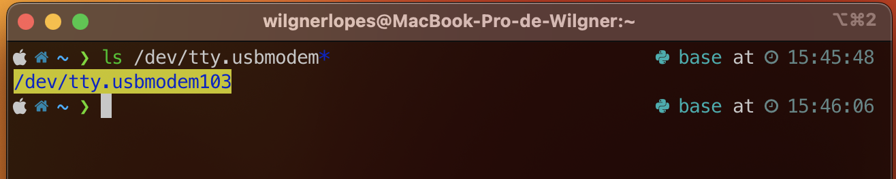
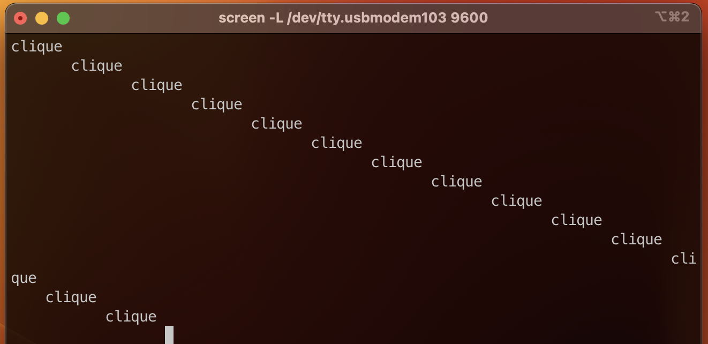
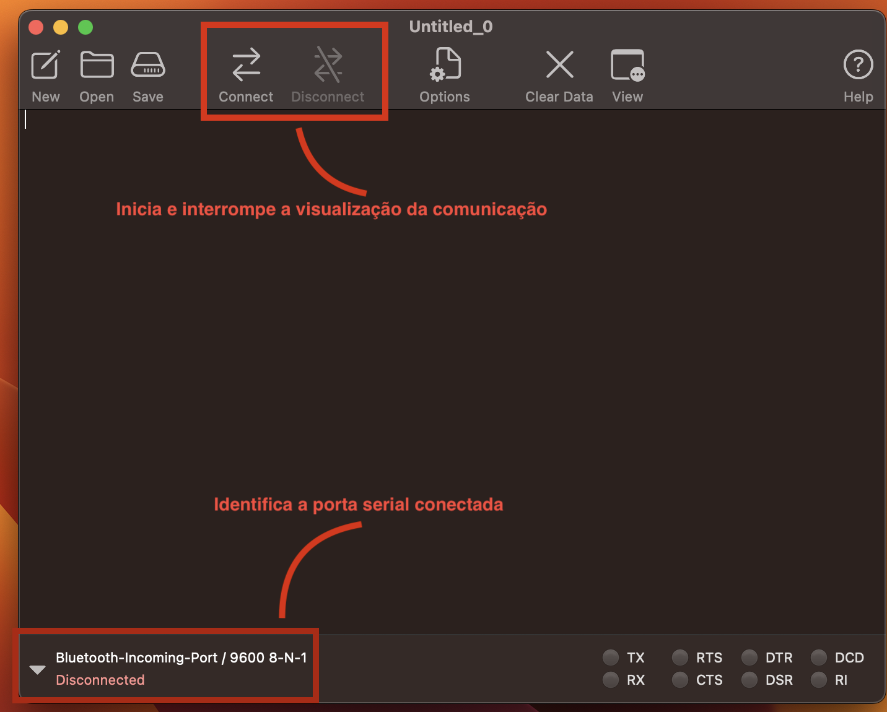
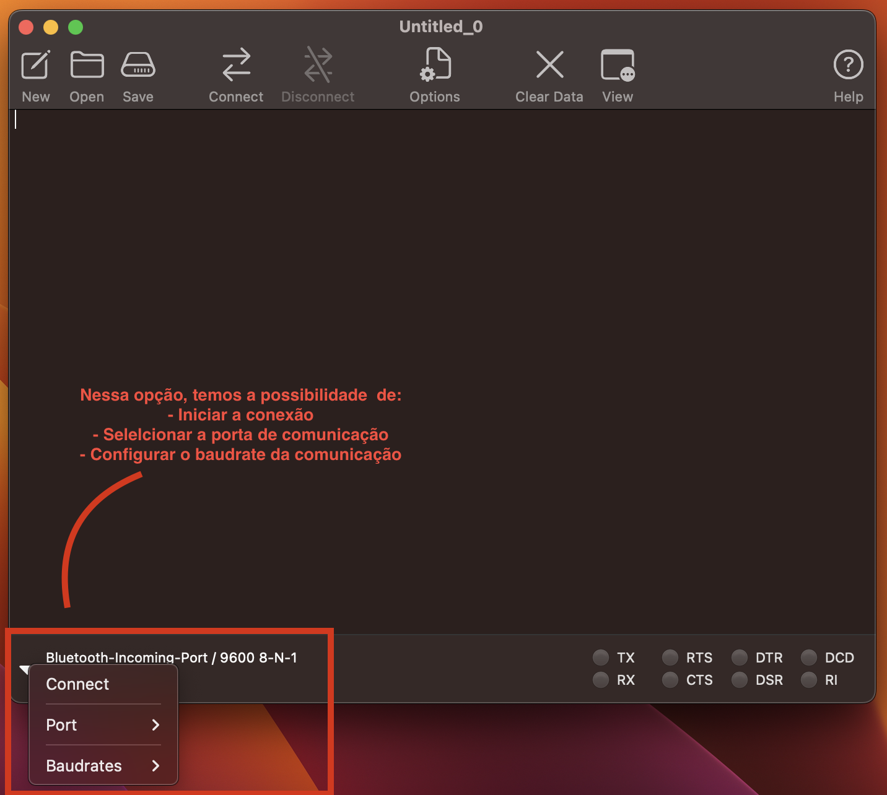
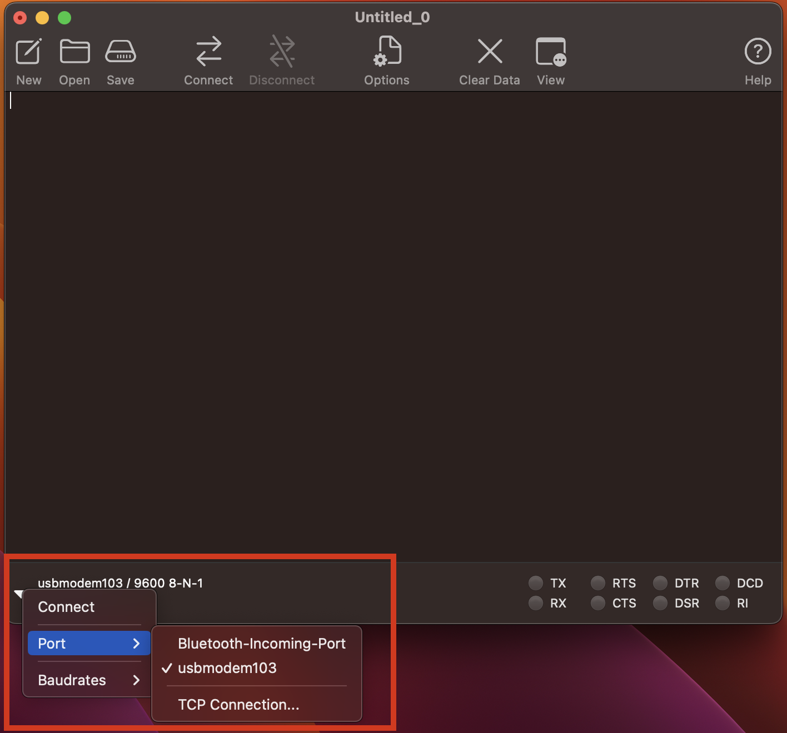
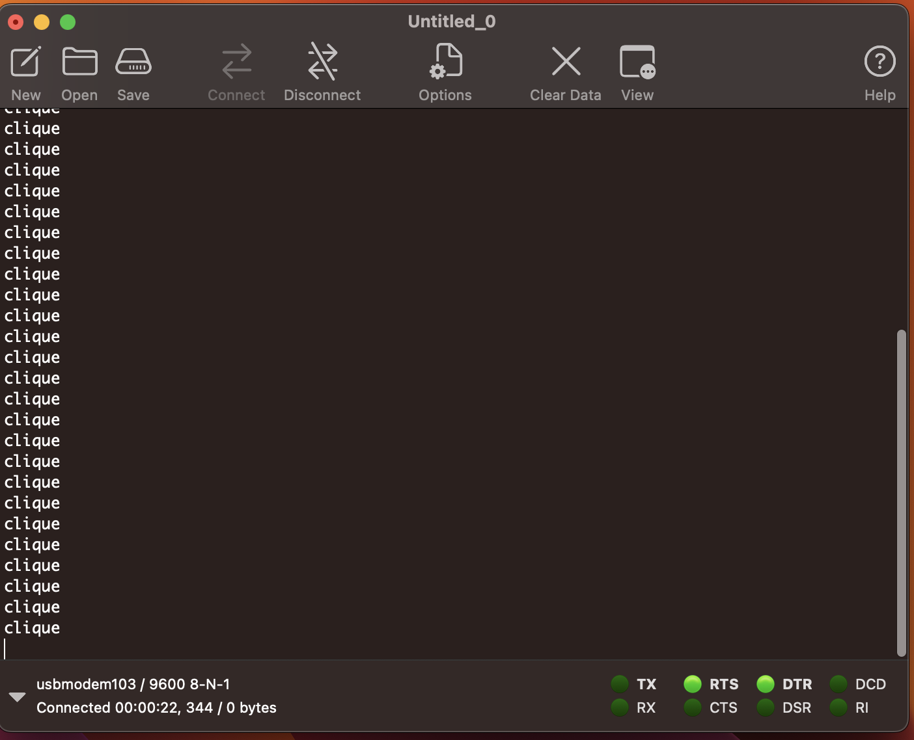

Autor: Wilgner Lopes

# utorial de configuração do acesso serial ST-link no MacOS

## Objetivo

- Realizar a comunicação serial em um ambiente MacOS ou Linux

## Introdução

- O objetivo desse tutorial é auxiliar o aluno na configuração para comunicação na porta serial em notebooks com sistema operacional linux ou MacOS

### Requisitos

- Placa NUCLEO-F103

### Pratica 1 - Comunicação serial sem instalaçao de nenhum software

- Nesta primeira pratica, iremos configurar a comunicação na porta serial utilizando apenas os drives nativos do nosso sistema operacional, para isso utilizaremos o tutorial encontrado no site da [ARM/MBED](https://os.mbed.com/handbook/Mac-or-Linux-terminals):

  1. O tutorial consiste em duas etapas. Primeiro identificar a presença da nossa placa nucleo na lista de dispositivos encontrado:

  ```shell
  Comando:
  ls /dev/tty.usbmodem*
  ```

  <center></center>

  - Na linha abaixo do comando, podemos encontrar a identificação da nossa placa no sistema

  2. E depois utilizar o serviço nativo screen para monitorar a comunicação:

  ```shell
  Comando:
  screen -L /dev/tty.usbmodem103 9600
  ```

  - Com esse comando digitado, ele ira mostrar a tela de comunicação:
  <center></center>

  **OBS:** Para interromper a tela você pode: fechar o terminal ou desconectar a placa nucleo do seu notebook.

### Pratica 2 - Comunicação serial com o software CoolTerm

- Nesta pratica, nos iremos utilizar o software CoolTerm para visualizar a comunicação serial. A vantagem do CoolTerm em relação ao terminal nativo é a possibilidade de ações que podem ser usadas para configurar a comunicação serial.

- Quando você abre o coolterm, essa é a tela inicial encontrada:

  <center></center>

  <center></center>

- Apresentada as funções basta ver se sua placa ja esta conectada no software, caso nao esteja busque na opções portas e selecione la sua nucleo.

<center></center>

- Apos a seleção, basta clicar em conectar e visualizar a comunicação

<center></center>

### Conclusão

- Nesse tutorial, você aprendeu duas formas de configurar sua comunicação serial entre a placa nucleo e seu computador
